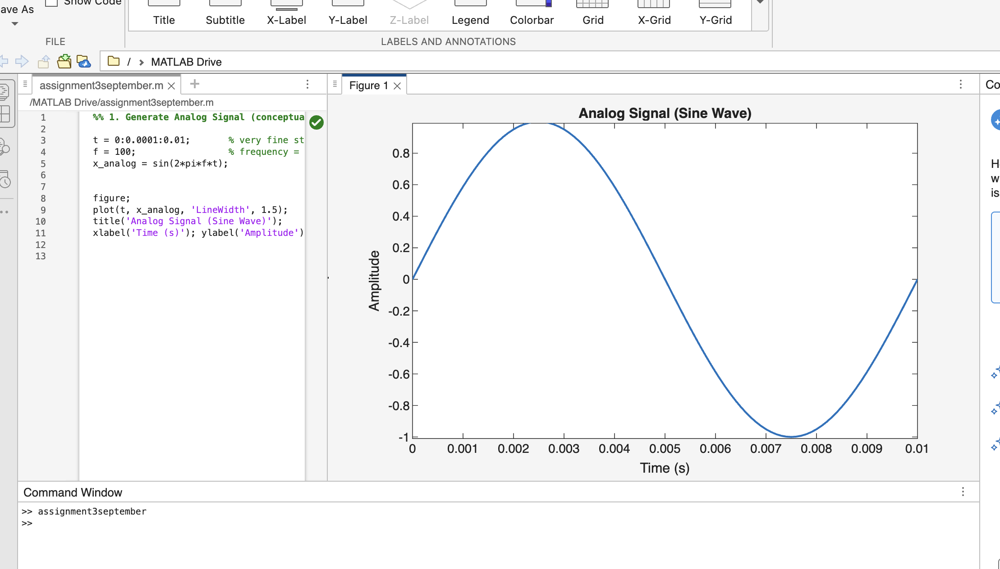
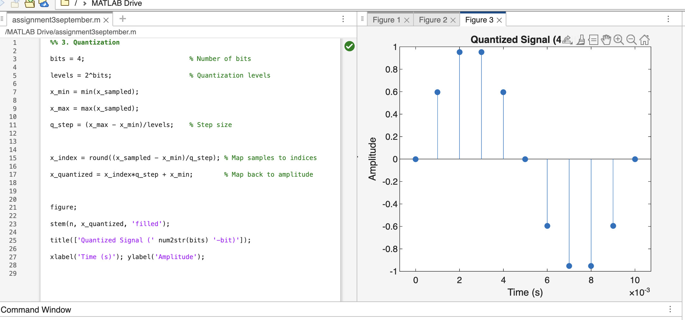
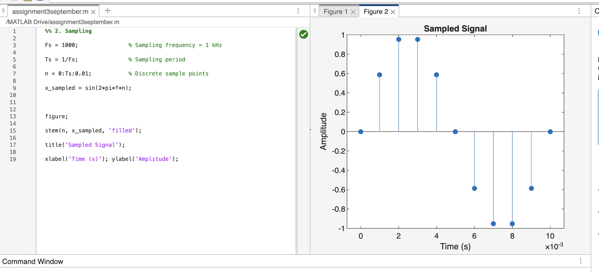

# Analog-to-digital-path
MATLAB simulation of Analog-to-Digital Conversion (ADC) pipeline: analog signal generation, sampling, quantization, encoding, and bitstream representation. Includes experiments with different sampling rates and quantization levels for IoT sensor data acquisition.
1. Analog Signal Generation

In MATLAB, generate a simple continuous-time signal (e.g., sine wave).

%% 1. Generate Analog Signal (conceptual)

t = 0:0.0001:0.01;       % very fine step (continuous-like time)

f = 100;                 % frequency = 100 Hz

x_analog = sin(2*pi*f*t);

 

figure;

plot(t, x_analog, 'LineWidth', 1.5);

title('Analog Signal (Sine Wave)');

xlabel('Time (s)'); ylabel('Amplitude');

 

 2. Sampling

Sample the analog signal at a chosen sampling frequency.

%% 2. Sampling

Fs = 1000;               % Sampling frequency = 1 kHz

Ts = 1/Fs;               % Sampling period

n = 0:Ts:0.01;           % Discrete sample points

x_sampled = sin(2*pi*f*n);

 

figure;

stem(n, x_sampled, 'filled');

title('Sampled Signal');

xlabel('Time (s)'); ylabel('Amplitude');

 

 Discussion: Compare analog vs sampled wave. Relate to Nyquist theorem.

3. Quantization

Simulate quantization by rounding amplitudes to finite levels.

%% 3. Quantization

bits = 4;                           % Number of bits

levels = 2^bits;                    % Quantization levels

x_min = min(x_sampled);

x_max = max(x_sampled);

q_step = (x_max - x_min)/levels;    % Step size

 

x_index = round((x_sampled - x_min)/q_step); % Map samples to indices

x_quantized = x_index*q_step + x_min;        % Map back to amplitude

 

figure;

stem(n, x_quantized, 'filled');

title(['Quantized Signal (' num2str(bits) '-bit)']);

xlabel('Time (s)'); ylabel('Amplitude');

 

 Discussion: More levels → higher accuracy, less compression.

 4. Encoding

Convert quantized values into binary codes.

%% 4. Encoding (Binary Representation)

binary_codes = dec2bin(x_index, bits); % Convert indices to binary words

 

disp('--- First 10 encoded samples ---');

disp(binary_codes(1:10,smile);

 

 

Now see how each quantized sample becomes a digital word.

 

5. Digital Signal Representation

Show the digital stream (bit sequence).

%% 5. Digital Bitstream

bitstream = reshape(binary_codes.',1,[]); % Concatenate into one string

disp('--- First 40 bits of the stream ---');

disp(bitstream(1:40));

 

 

%% Summary

fprintf('\nSimulation complete!\n');

fprintf('Analog -> Sampling -> Quantization -> Binary Encoding -> Digital Stream\n');

fprintf('Bits per sample: %d\n', bits);

fprintf('Total samples: %d\n', length(x_sampled));

fprintf('Total bits: %d\n', length(bitstream));
